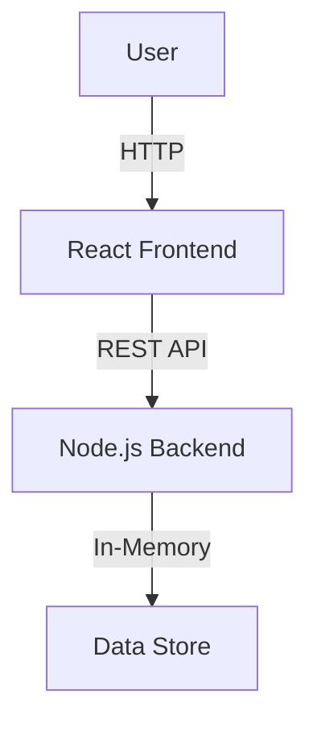

# Brainbolt

Brainbolt is an adaptive quiz application that adjusts difficulty based on user performance.

## Architecture



## How to Run

### Prerequisites

- Docker and Docker Compose

### Steps

1. Clone the repository.
2. Run `docker-compose up --build`.
3. Access the frontend at `http://localhost:5173`.
4. Access the backend API at `http://localhost:4000`.

## Adaptive Logic

- **Increase Difficulty**: Occurs when the user's streak reaches 2 or more.
- **Decrease Difficulty**: Occurs immediately upon a wrong answer.
- **Bounds**: Difficulty is clamped between 1 and 10.

## Ping Pong Stabilization

To prevent the difficulty from oscillating too rapidly ("ping-ponging"), we require a streak of at least 2 consecutive correct answers before increasing the difficulty. Decreasing happens immediately to prevent frustration.

## Score Formula

```
difficultyWeight = difficulty * 10
streakMultiplier = min(1 + (streak * 0.1), 2.0)
score = difficultyWeight * streakMultiplier
```

## Tradeoffs

- **In-Memory Store**: Fast and simple for MVP, but data is lost on restart. Not suitable for production scaling.
- **No Authentication**: Simple user ID generation on frontend/backend. Secure auth would be needed for a real app.
- **Polling/Fetch**: We fetch state on persistent actions. WebSockets could provide real-time updates for leaderboards.

## Future Improvements

- PostgreSQL database for persistence.
- Redis for caching leaderboards.
- User authentication (Auth0 or JWT).
- Real-time multiplayer mode.
